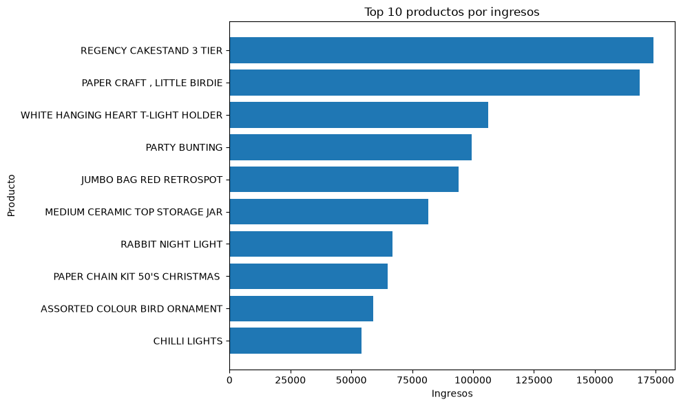
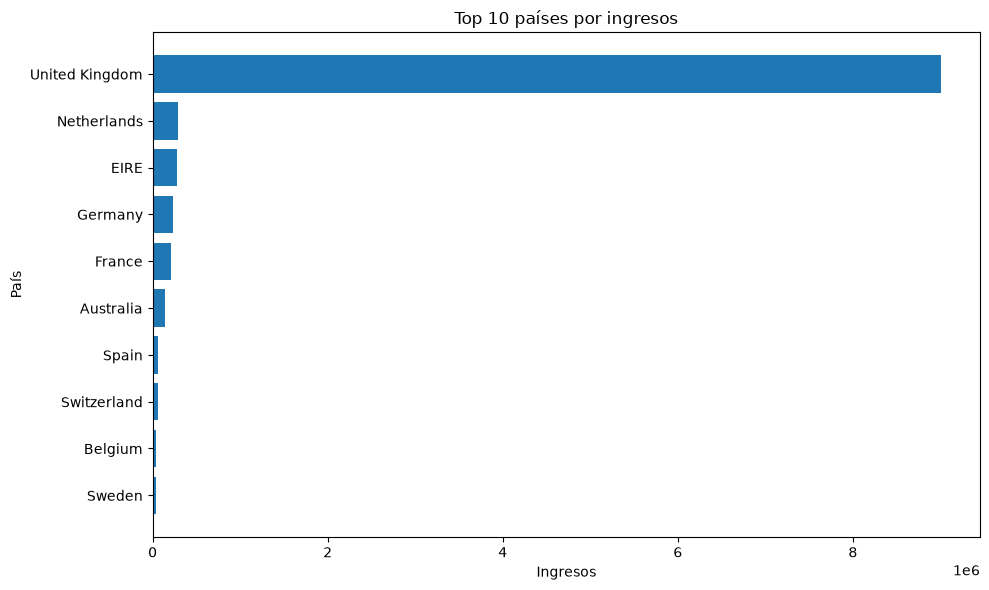
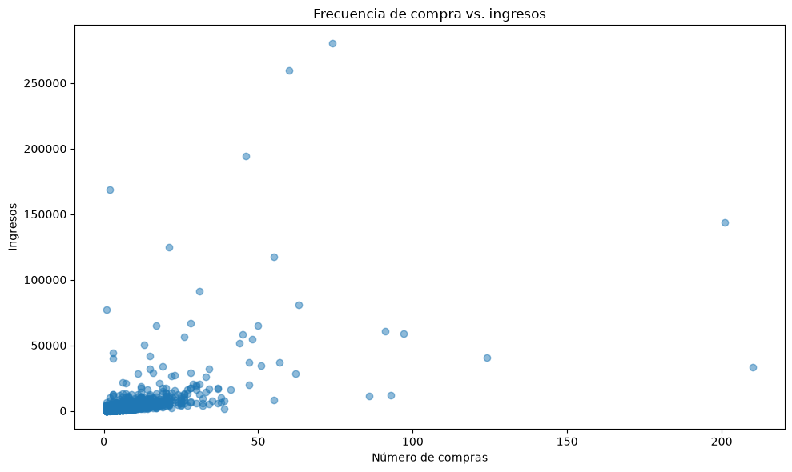

# Online Retail Sales Analysis

## 📊 Descripción

Este proyecto presenta un análisis exploratorio de datos de ventas de una tienda online. El objetivo es analizar el comportamiento de las ventas, identificar patrones y obtener información relevante sobre los ingresos, productos, clientes y países.

El proyecto fue desarrollado como parte de mi proceso de aprendizaje en **Análisis de Datos con Python**.

## 🎯 Objetivos

* Analizar el comportamiento de las ventas a lo largo del tiempo.
* Identificar los países con mayores ingresos.
* Analizar los productos con mayor cantidad de unidades vendidas.
* Identificar los productos que generan mayores ingresos.
* Explorar el comportamiento de los clientes.
* Obtener conclusiones a partir de los datos.

## 🛠️ Tecnologías utilizadas

* **Python**
* **Pandas** — Manipulación y análisis de datos.
* **NumPy** — Operaciones numéricas.
* **Matplotlib** — Visualización de datos.
* **Seaborn** — Visualización estadística.
* **Jupyter Notebook** — Desarrollo y documentación del análisis.

## 📁 Estructura del proyecto

```text
online-retail-analysis/
│
├── data/
│
├── notebooks/
│   └── sales_analysis.ipynb
│
├── .gitignore
├── README.md
└── requirements.txt
```

## 🔎 Proceso de análisis

El análisis se desarrolló siguiendo las siguientes etapas:

### 1. Exploración de los datos

Se realizó una exploración inicial para conocer:

* Número de registros y variables.
* Tipos de datos.
* Valores faltantes.
* Estadísticas descriptivas.
* Distribución de las principales variables.

### 2. Limpieza de datos

Se realizaron procesos de limpieza y preparación de los datos, incluyendo:

* Tratamiento de valores faltantes.
* Conversión de tipos de datos.
* Identificación de registros inconsistentes.
* Creación de nuevas variables para facilitar el análisis.

### 3. Transformación

Se crearon variables derivadas para obtener información adicional, incluyendo el cálculo de los ingresos por transacción:

**Revenue = Quantity × UnitPrice**

También se realizaron agrupaciones por diferentes dimensiones como tiempo, país, producto y cliente.

### 4. Análisis exploratorio

Se analizaron diferentes aspectos del comportamiento de las ventas:

* Evolución de los ingresos.
* Ventas por país.
* Productos más vendidos.
* Productos con mayores ingresos.
* Comportamiento de los clientes.
* Tendencias temporales.

### 5. Visualización

Se utilizaron **Matplotlib** y **Seaborn** para representar los principales resultados mediante diferentes tipos de gráficos.

## 📈 Principales resultados


- **Alta concentración geográfica:** United Kingdom representa aproximadamente el 84,59 % de los ingresos, lo que evidencia una fuerte dependencia del mercado británico.

- **Estacionalidad de las ventas:** Noviembre de 2011 fue el mes con mayores ingresos, alcanzando aproximadamente 1,50 millones. Aunque diciembre presenta una facturación inferior, este resultado debe interpretarse con precaución debido a que el conjunto de datos solamente contiene información hasta el 9 de diciembre de 2011.

- **Productos de alto volumen:** PAPER CRAFT, LITTLE BIRDIE fue el producto con mayor cantidad de unidades vendidas, con 80.995 unidades.

- **Productos de mayor facturación:** REGENCY CAKESTAND 3 TIER generó los mayores ingresos entre los productos analizados, con 174.156,54.

- **Concentración de clientes:** algunos clientes generan una proporción importante de los ingresos. El cliente 14646 fue el de mayor facturación, con 280.206,02.

- **Frecuencia y valor no son lo mismo:** el cliente con mayor número de compras fue el 12748, con 210 facturas, mientras que el cliente 14646 lideró en ingresos. Esto demuestra que la frecuencia de compra y el valor generado deben analizarse como métricas diferentes.

## 💡 Conclusiones

El análisis permitió identificar patrones relevantes en el comportamiento de las ventas, los productos, los mercados y los clientes. Los resultados muestran una fuerte concentración de los ingresos en Reino Unido y en determinados clientes y productos.

El análisis temporal también permitió identificar variaciones importantes en los ingresos a lo largo del período estudiado, destacándose noviembre de 2011 como el mes de mayor facturación.

Finalmente, el análisis de clientes demuestra que la frecuencia de compra no necesariamente representa un mayor valor económico, por lo que resulta conveniente considerar conjuntamente métricas como ingresos, frecuencia y ticket promedio para evaluar el comportamiento de los clientes.

## 📊 Visualizaciones

### Top 10 productos por ingresos



### Top 10 países por ingresos



### Frecuencia de compra e ingresos



## 📓 Notebook

El análisis completo, incluyendo la exploración, limpieza, transformación, visualización y conclusiones, se encuentra en el siguiente notebook:

👉 **[Ver análisis completo](notebooks/online-retail-sales-analysis.ipynb)**

## 🚀 Próximos pasos

Como continuación del proyecto, se podrían desarrollar:

* Un dashboard interactivo en **Power BI**.
* Análisis más detallado de clientes.
* Segmentación de clientes.
* Indicadores clave de rendimiento (KPIs).
* Análisis de tendencias y estacionalidad.

## 👤 Autor

**Angel Junior Gonzalez Zuleta**

Proyecto desarrollado como parte del proceso de formación en **Análisis de Datos**.
